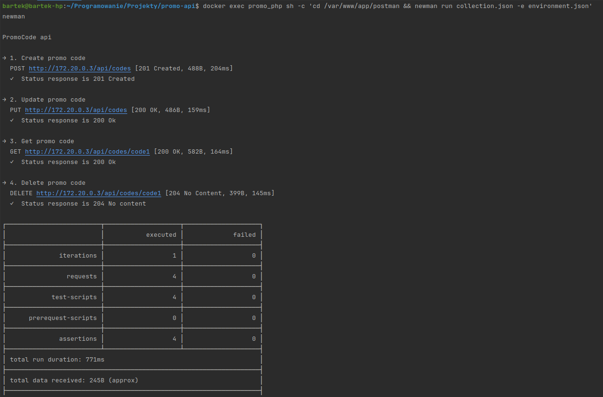
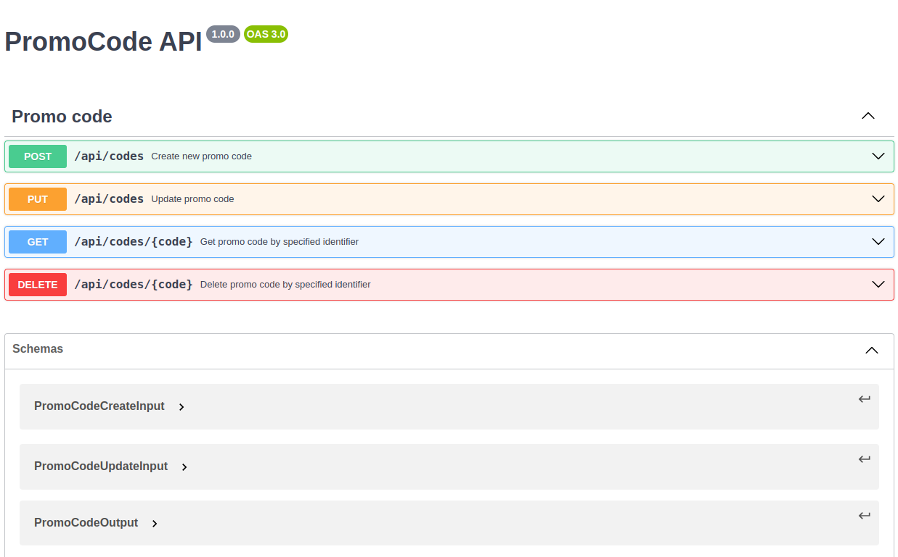

# PromoCode - PHP8 & ApiPlatform 3
> **Description**: Simple REST API to manage promo codes

### 1 - How to run
> docker compose up -d

### 2 - Install packages
> docker exec promo_php composer install

### 3 - Run migrations to setup database
> docker exec promo_php bin/console --no-interaction doctrine:migrations:migrate

### 4 - Run functional tests to determine if application is running (postman directory)
> **Make sure that proper nginx container IP is set as host in postman environment file (currently 172.20.0.3)**

> docker exec promo_php sh -c 'cd /var/www/app/postman && newman run collection.json -e environment.json'

### 5 - Documentation (edit in https://editor.swagger.io/)
> /docs/api.yaml

